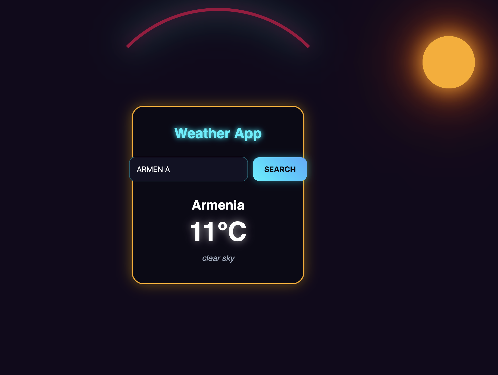
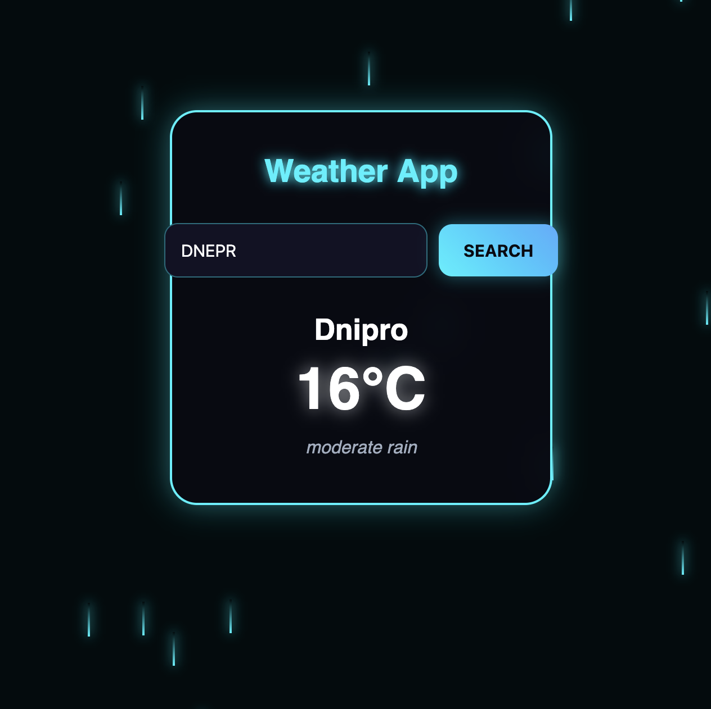

# 🌤️ Dynamic Weather App

A stylish, responsive web application that fetches real-time weather data and dynamically changes its interface, animations, and visual effects based on the current weather conditions.

## 📱 UI Demo

  
  

* **Dynamic Design:** The application seamlessly adapts to the weather. For instance, `clear sky` triggers a warm glow with a shining sun element, while `moderate rain` activates a beautiful neon-animated falling raindrops effect.

## 🚀 Features

* **Real-time Data:** Fetches live weather updates via API.
* **Immersive Visuals:** Dynamic background changes and custom CSS animations matching the weather state.
* **Modern UI:** Clean, glow-infused neon interface design.
* **Responsive Layout:** Optimized for both desktop and mobile screens.

## 🛠️ Technologies Used

* HTML5
* CSS3 (Custom animations and neon glow effects)
* JavaScript / TypeScript (Vanilla JS, Fetch API)
